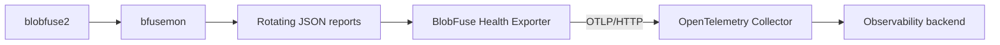

# BlobFuse Health Exporter

An independent OpenTelemetry metrics adapter for BlobFuse health reports.

> **Project status:** The version 0 implementation is complete and locally
> validated against the tested configuration below. No release is published yet.

BlobFuse2 includes a companion process, `bfusemon`, that writes health data to
rotating JSON reports. BlobFuse Health Exporter is designed to consume those
reports outside the filesystem I/O path and export a small, privacy-bounded
metric set through OTLP/HTTP.

This is an independent community project. It is not an official Microsoft or
Azure product.

## Version 0 Scope

The first milestone is a standalone Go executable for Linux that:

- watches one dedicated `bfusemon` report directory for one BlobFuse process;
- incrementally reads incomplete, appended, and rotated JSON reports;
- establishes independent per-series baselines without replaying history;
- exports cumulative counters and current gauges with OTLP/HTTP Protobuf;
- works with a local OpenTelemetry Collector or Prometheus OTLP receiver;
- prevents file paths, blob names, credentials, and arbitrary source values
  from becoming metric attributes; and
- remains independent of Azure Storage credentials and BlobFuse's request path.

Initial compatibility targets recorded fixtures from BlobFuse2 `2.5.6` and
`bfusemon` `1.0.0-preview.1`. Compatibility with other versions must be proven
with fixtures and tests.

## Tested Configuration

The current version 0 validation was performed with:

- Ubuntu 26.04 LTS under WSL2, Linux
  `6.18.33.2-microsoft-standard-WSL2`, x86-64;
- Go `1.25.7`, including race-detector tests with GCC `15.2.0`;
- sanitized source fixtures from BlobFuse2 `2.5.6` and `bfusemon`
  `1.0.0-preview.1`;
- OpenTelemetry Collector `0.159.0`; and
- Prometheus/promtool `3.14.0`.

BlobFuse2 and `bfusemon` were not installed or mounted during this validation.
Source compatibility claims are therefore limited to the recorded fixtures and
do not imply compatibility with other BlobFuse or Linux versions.

## Architecture

Version 0 reads report files only. BlobFuse's private FIFOs are outside its
contract. A future upstream exporter contract could remove the rotating-file
adapter without changing the public metric model.

## Design Documents

| Document | Purpose |
| --- | --- |
| [High-level design](docs/high-level-design.md) | Goals, phases, architecture, and v0 scope |
| [Source contract](docs/source-contract.md) | Reverse-engineered `bfusemon` framing, rotation, identity, and failure behavior |
| [Metrics contract](docs/metrics.md) | Metric names, types, units, attributes, temporality, and privacy rules |
| [Version 0 configuration](docs/configuration.md) | Planned CLI, defaults, deadlines, delivery semantics, and resource budgets |
| [ADR 0001](docs/decisions/0001-adapter-architecture.md) | Decision to begin with an independent JSON-to-OTLP adapter |
| [Post-v0 follow-up](docs/future-work.md) | Accepted work intentionally deferred beyond the prototype |

The design treats the current `bfusemon` format as a private, unversioned input.
The source contract is an observed compatibility target, not a promise made by
the BlobFuse project.

## Metric Model

Version 0 uses a strict allowlist of aggregate metrics, including:

- storage bytes transferred;
- allowlisted filesystem operation counts;
- open file handles;
- whole-file cache downloads, hits, usage, and utilization; and
- monitored BlobFuse virtual memory.

BlobFuse-derived counters are best-effort lower bounds because upstream queues
can discard observations without reporting a dropped count. They are intended
for operational monitoring, not billing, auditing, or data-integrity accounting.

All sums use cumulative OTLP temporality. Prometheus can consume them through
its OTLP receiver or through a Collector exposing a Prometheus endpoint. Version
0 does not provide a direct `/metrics` endpoint.

## Security and Privacy

The reports can contain file and blob paths. The v0 design therefore requires:

- an empty, dedicated report directory for each mount;
- the exporter and `bfusemon` to run under the same effective UID;
- owner and permission validation through opened file descriptors;
- no-follow, descriptor-relative report opening; and
- a loopback-only OTLP endpoint, with remote TLS and authentication delegated to
  the Collector.

Path-bearing events are parsed only far enough to advance the source watermark
and are then discarded. Raw records and sensitive paths must not be logged.

## Roadmap

- [x] Define the source, metric, configuration, and privacy contracts.
- [x] Complete peer and implementation-readiness design reviews.
- [x] Implement source identity and the incremental rotation-aware decoder.
- [x] Add sanitized fixtures and source state-machine tests.
- [x] Implement metric translation and cumulative OTLP export.
- [x] Add Collector and Prometheus integration tests.
- [x] Validate resource budgets on a supported Linux environment.

Post-v0 candidates include a declarative metric registry, typed procfs metrics,
direct secure OTLP configuration, and typed permanent-failure handling. They are
documented but are not requirements for the first proof of concept.

## Contributing

Implementation work should preserve the normative contracts under `docs/`.
Design changes should update the relevant contract and tests in the same change.
Issues and focused design feedback are welcome while the initial implementation
is being built.

## Related Projects

- [Azure Storage Fuse](https://github.com/Azure/azure-storage-fuse)
- [OpenTelemetry](https://opentelemetry.io/)
- [OpenTelemetry Collector](https://github.com/open-telemetry/opentelemetry-collector)

## License

Licensed under the [Apache License 2.0](LICENSE).