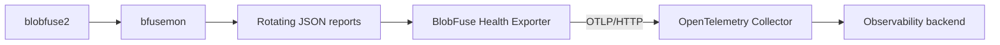

# BlobFuse Health Exporter

[](https://github.com/AaronWangTT/blobfuse-health-exporter/actions/workflows/ci.yml)

An independent OpenTelemetry metrics adapter for BlobFuse health reports.

> **Project status:** The version 0 implementation is complete and locally
> validated against the tested configuration below. No release is published yet.

BlobFuse2 includes a companion process, `bfusemon`, that writes health data to
rotating JSON reports. BlobFuse Health Exporter is designed to consume those
reports outside the filesystem I/O path and export a small, privacy-bounded
metric set through OTLP/HTTP.

This is an independent community project. It is not an official Microsoft or
Azure product.

## Version 0 Scope

The first milestone is a standalone Go executable for Linux that:

- watches one dedicated `bfusemon` report directory for one BlobFuse process;
- incrementally reads incomplete, appended, and rotated JSON reports;
- establishes independent per-series baselines without replaying history;
- exports cumulative counters and current gauges with OTLP/HTTP Protobuf;
- works with a local OpenTelemetry Collector or Prometheus OTLP receiver;
- prevents file paths, blob names, credentials, and arbitrary source values
  from becoming metric attributes; and
- remains independent of Azure Storage credentials and BlobFuse's request path.

Initial compatibility targets recorded fixtures from BlobFuse2 `2.5.6` and
`bfusemon` `1.0.0-preview.1`. Compatibility with other versions must be proven
with fixtures and tests.

## Tested Configuration

The current version 0 validation was performed with:

- Ubuntu 26.04 LTS under WSL2, Linux
  `6.18.33.2-microsoft-standard-WSL2`, x86-64;
- Go `1.25.7`, including race-detector tests with GCC `15.2.0`;
- Microsoft Go `1.26.4` for the live BlobFuse build;
- sanitized source fixtures from BlobFuse2 `2.5.6` and `bfusemon`
  `1.0.0-preview.1`;
- a real BlobFuse2 `2.5.6` mount and `bfusemon` process backed by Azurite
  `3.29.0`;
- OpenTelemetry Collector `0.159.0`; and
- Prometheus/promtool `3.14.0`.

The live test exercises FUSE, BlobFuse's stats FIFOs, `bfusemon` report output,
strict exporter source validation, Prometheus OTLP ingestion, privacy, and
source-driven shutdown. It does not use an Azure Storage account, so service
compatibility remains outside the Azurite-backed claim. Other BlobFuse and
Linux versions still require independent compatibility evidence.

## Real-Mount Integration

The credential-free E2E requires Linux FUSE3 runtime and development files,
`/dev/fuse` access, Go, Node.js, Azure CLI, Azurite `3.29.0`, OpenTelemetry
Collector `0.159.0`, and Prometheus `3.14.0`. Run it as one non-root user so
BlobFuse, `bfusemon`, and the exporter share a UID:

```bash
BLOBFUSE2_REPO=/absolute/path/to/azure-storage-fuse \
BLOBFUSE_GO_BIN=/absolute/path/to/go1.26.4/bin/go \
OTELCOL_BIN=/absolute/path/to/otelcol \
PROMETHEUS_BIN=/absolute/path/to/prometheus \
AZURITE_BIN=/absolute/path/to/azurite-blob \
bash test/integration/azurite-mount-e2e.sh
```

`GO_BIN` and `AZ_BIN` can override the exporter Go and Azure CLI commands. The
harness builds into a private temporary directory, mounts BlobFuse in the
foreground under `umask 077`, and removes its mount, processes, and data on
completion. By default it runs BlobFuse's upstream quick stress test after the
exporter reaches live cutover and verifies exact observed deltas of 13
`CreateDir`, 24 `DeleteFile`, and 13 `DeleteDir` operations. Set
`E2E_STRESS_MODE=full`, `E2E_STRESS_TIMEOUT=120m`, and an appropriately sized
`E2E_CACHE_SIZE_MB` to run the upstream full workload instead. Scheduled full
mode also increases `E2E_CACHE_TIMEOUT_SEC` so its read phase remains a mounted
file-cache workload rather than a separate Azurite throughput benchmark.

In GitHub Actions, the real-mount job writes the Prometheus-ingested metric
names, labels, and values to the workflow run's **Summary** page. Its
`blobfuse-real-mount-metrics` artifact contains the Collector's detailed OTLP
debug representation and the corresponding Prometheus query result. The
artifact excludes raw `bfusemon` reports and BlobFuse configuration.

Pull requests run the quick stress mode as a required CI job. The **Daily
Blobfuse stress** workflow runs full mode every day and on manual dispatch. It
expects exact observed deltas of 67 `CreateDir`, 2,022 `DeleteFile`, and 67
`DeleteDir` operations and publishes the `blobfuse-full-stress-metrics`
artifact. The full workload creates 2,022 files totaling about 10 GiB across
sequential small, big, and huge phases.

## Architecture



Version 0 reads report files only. BlobFuse's private FIFOs are outside its
contract. A future upstream exporter contract could remove the rotating-file
adapter without changing the public metric model.

## Design Documents

| Document | Purpose |
| --- | --- |
| [High-level design](docs/high-level-design.md) | Goals, phases, architecture, and v0 scope |
| [Source contract](docs/source-contract.md) | Reverse-engineered `bfusemon` framing, rotation, identity, and failure behavior |
| [Metrics contract](docs/metrics.md) | Metric names, types, units, attributes, temporality, and privacy rules |
| [Version 0 configuration](docs/configuration.md) | Planned CLI, defaults, deadlines, delivery semantics, and resource budgets |
| [ADR 0001](docs/decisions/0001-adapter-architecture.md) | Decision to begin with an independent JSON-to-OTLP adapter |
| [Post-v0 follow-up](docs/future-work.md) | Accepted work intentionally deferred beyond the prototype |

The design treats the current `bfusemon` format as a private, unversioned input.
The source contract is an observed compatibility target, not a promise made by
the BlobFuse project.

## Metric Model

Version 0 uses a strict allowlist of aggregate metrics, including:

- storage bytes transferred;
- allowlisted filesystem operation counts;
- open file handles;
- whole-file cache downloads, hits, usage, and utilization; and
- monitored BlobFuse virtual memory.

BlobFuse-derived counters are best-effort lower bounds because upstream queues
can discard observations without reporting a dropped count. They are intended
for operational monitoring, not billing, auditing, or data-integrity accounting.

All sums use cumulative OTLP temporality. Prometheus can consume them through
its OTLP receiver or through a Collector exposing a Prometheus endpoint. Version
0 does not provide a direct `/metrics` endpoint.

## Security and Privacy

The reports can contain file and blob paths. The v0 design therefore requires:

- an empty, dedicated report directory for each mount;
- the exporter and `bfusemon` to run under the same effective UID;
- owner and permission validation through opened file descriptors;
- no-follow, descriptor-relative report opening; and
- a loopback-only OTLP endpoint, with remote TLS and authentication delegated to
  the Collector.

Path-bearing events are parsed only far enough to advance the source watermark
and are then discarded. Raw records and sensitive paths must not be logged.

### Interim Report-Permission Workaround

Until BlobFuse creates health reports with owner-only permissions, treat the
entire `health_monitor.output-path` as sensitive. For every mount lifetime,
provision a new absolute directory owned by the account that will run BlobFuse,
`bfusemon`, and this exporter. For example, replace the example user and group
with the deployment's service account:

```bash
REPORT_DIR=/var/lib/blobfuse/health/my-mount
sudo install -d -m 0700 -o blobfuse -g blobfuse "$REPORT_DIR"
```

Configure that exact path and do not reuse it for a later mount:

```yaml
health_monitor:
  enable-monitoring: true
  output-path: /var/lib/blobfuse/health/my-mount
```

A mode-`0700` directory prevents other local users from traversing to reports
even when a report itself has broader permission bits. This is the minimum
privacy workaround for an existing BlobFuse deployment. Confirm that the
directory owner matches the service user and that no bind mount or alternate
path bypasses the private parent.

Strict exporter mode also validates every report file, so the private parent
directory alone is not sufficient for ingestion. BlobFuse daemon mode currently
resets the process umask; setting `umask 077` before a default background mount
therefore does not constrain reports created by `bfusemon`. Launch BlobFuse in
foreground mode from a backgrounded shell so it and `bfusemon` inherit the
restrictive umask:

```bash
(
    umask 077
    export PATH="/path/containing/bfusemon:$PATH"
    exec blobfuse2 mount "$MOUNT_DIR" \
        --config-file="$CONFIG_FILE" \
        --foreground=true
) &
blobfuse_pid=$!

blobfuse-health-exporter \
    --report-dir "$REPORT_DIR" \
    --pid "$blobfuse_pid"
```

For a service manager, use the equivalent foreground process model, run both
programs under the same service account, and set its process umask to `0077`.
For example, a systemd service should use `Type=simple`, `User=...`,
`UMask=0077`, and a BlobFuse `ExecStart` containing `--foreground=true`.

If an existing daemonized mount cannot be restarted, keep its dedicated report
directory at `0700` and the exporter under the same UID. As a temporary
compatibility measure only, `--allow-insecure-source` relaxes directory and
report owner and group/other mode checks while retaining process-identity,
descriptor-relative no-follow, and regular-file validation. Remove the override
after deploying an owner-only report source. Do not use a periodic `chmod`:
rotation creates new reports and leaves a disclosure and ingestion race before
each correction.

## Roadmap

- [x] Define the source, metric, configuration, and privacy contracts.
- [x] Complete peer and implementation-readiness design reviews.
- [x] Implement source identity and the incremental rotation-aware decoder.
- [x] Add sanitized fixtures and source state-machine tests.
- [x] Implement metric translation and cumulative OTLP export.
- [x] Add Collector and Prometheus integration tests.
- [x] Validate the real BlobFuse, `bfusemon`, Azurite, and OTLP pipeline.
- [x] Validate resource budgets on a supported Linux environment.

Post-v0 candidates include a declarative metric registry, typed procfs metrics,
direct secure OTLP configuration, and typed permanent-failure handling. They are
documented but are not requirements for the first proof of concept.

## Contributing

Implementation work should preserve the normative contracts under `docs/`.
Design changes should update the relevant contract and tests in the same change.
Issues and focused design feedback are welcome while the initial implementation
is being built.

## Related Projects

- [Azure Storage Fuse](https://github.com/Azure/azure-storage-fuse)
- [OpenTelemetry](https://opentelemetry.io/)
- [OpenTelemetry Collector](https://github.com/open-telemetry/opentelemetry-collector)

## License

Licensed under the [Apache License 2.0](LICENSE).