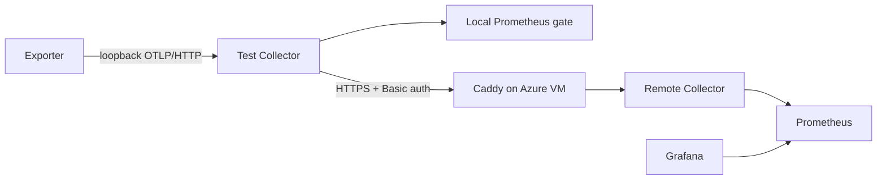

# Azure VM Metrics Dashboard

This package deploys a durable endpoint for metrics produced by trusted
Blobfuse integration-test runs.



The local Prometheus path remains the test oracle and artifact source. Remote
delivery is additive, so pull requests do not depend on the VM. The remote
Collector receives metrics only; Caddy does not expose Collector, Prometheus,
or Grafana container ports directly.

## Existing VM

`deploy-existing-vm.sh` installs the backend on an existing Linux VM that
already runs a Caddy Compose service. It does not create Azure resources or
publish new host ports. Instead, it:

- starts Collector, Prometheus, and Grafana on private Docker networks;
- attaches the existing Caddy service to one shared edge network;
- adds authenticated `/blobfuse-otlp/v1/metrics` and
   `/blobfuse-grafana/` routes before the gateway's existing catch-all route;
- backs up and validates the existing Caddy configuration before recreating
   that service; and
- restores the original gateway and removes the observability stack if any
   installation or readiness check fails.

Initial installation requires a running Compose service named `caddy`, no
existing Compose override file, and one Caddy site block ending at the end of
the Caddyfile. A second installation attempt detects the managed route markers
and exits before changing the live stack. Updates should be applied from
`/opt/blobfuse-observability` rather than by rerunning initial installation.

The deployment uses a generated, marked SSH key installed through Azure Run
Command. The key is removed on both success and failure. To use the existing
`gwsea` defaults:

```bash
export CONFIRM_EXISTING_VM_CHANGES=yes
bash deploy/azure-vm/deploy-existing-vm.sh
```

Override `AZURE_RESOURCE_GROUP`, `AZURE_VM_NAME`, or `GATEWAY_DIR` when the
existing gateway has different names or paths. The script verifies the public
OTLP authentication behavior and Grafana health before updating GitHub Actions
settings. It stores the generated endpoint and operator credentials in
`~/.config/blobfuse-health-exporter/gwsea-observability` with mode `0600`.

## Prerequisites

- Azure CLI authenticated to the intended subscription.
- GitHub CLI (`gh` or a WSL-reachable `gh.exe`) authenticated with permission
   to manage Actions secrets and variables in
   `AaronWangTT/blobfuse-health-exporter`.
- `curl`, `openssl`, `ssh`, `scp`, and `tar`.
- An existing Linux VM with public DNS, Docker Compose, and a Caddy Compose
  service meeting the initial-install constraints above.

Authenticate interactively in the terminal, not through automation that logs
credentials:

```bash
az login
az account set --subscription '<subscription name or ID>'
gh auth status
```

## Deployment Flow

The existing-VM script generates independent OTLP and Grafana credentials. It
then:

1. grants a temporary, marked SSH key through Azure Run Command;
2. starts pinned Collector, Prometheus, and Grafana containers;
3. backs up, extends, validates, and recreates the existing Caddy service;
4. verifies unauthenticated OTLP requests are rejected and authenticated OTLP
   requests succeed;
5. writes the OTLP authorization value to the
   `BLOBFUSE_OTLP_AUTHORIZATION` GitHub Actions secret;
6. sets `BLOBFUSE_OTLP_METRICS_ENDPOINT` and
   `BLOBFUSE_GRAFANA_DASHBOARD_URL` as repository variables; and
7. retains operator credentials in a mode-`0600` local file and removes the
   temporary SSH key.

Initial deployment refuses to replace an existing repository telemetry secret.
Credential rotation is an explicit manual operation so endpoint variables and
the write credential can be coordinated.

The raw OTLP password is removed from the VM after Caddy hashes it and is not
written to the repository. The Grafana secret key and admin password remain in
the VM's root-only `/opt/blobfuse-observability/.env` file because Grafana needs
them at startup.

## CI Behavior

Pushes to `main`, scheduled daily runs, and manual runs explicitly dispatched
from `main` use the remote endpoint when both repository settings are present.
Pull requests and manual runs from other refs never receive the remote
credential. Every run continues to use local Prometheus for assertions and
sanitized evidence.

The test-side Collector adds these bounded resource attributes before
dual-exporting metrics:

- `cicd.pipeline.run.id`
- `cicd.pipeline.name`
- `vcs.ref.head.revision`
- `github.run.attempt`

Prometheus promotes them to labels such as `cicd_pipeline_run_id`. Workflow
summaries link to the provisioned `Blobfuse CI Telemetry` dashboard with the
current run filter selected. Grafana uses this dashboard as its home with the
filter set to All. Focused operation, I/O, memory, cache, and exporter-health
panels aggregate away run and attempt labels using metric-appropriate sums or
maxima. The run filter remains available for drill-down, while the repeated raw
metric explorer retains run identity. Range-window aggregation keeps short
completed jobs visible after Prometheus's five-minute active-series lookback.

## Operations

The stack is installed at `/opt/blobfuse-observability`. From an allowed SSH
source address:

```bash
ssh <vm-admin>@<azure-dns-name>
cd /opt/blobfuse-observability
sudo docker compose ps
sudo docker compose logs --tail=100
sudo docker compose pull
sudo docker compose up --detach
```

Prometheus retains metrics for 30 days by default. Set
`PROMETHEUS_RETENTION` before initial deployment to change the duration. Named
Docker volumes preserve Prometheus and Grafana state across container updates.

If remote installation succeeds but a later public or GitHub check fails, the
script retains the working stack and the local credential file and prints a
recovery message. Inspect `/opt/blobfuse-observability`, fix the failed check,
and configure GitHub from the retained credentials. Initial deployment is
intentionally not rerunnable over a managed live stack.

## Verified Existing Deployment

The existing-VM mode was validated on 2026-08-23 against `gwsea` in Azure
Southeast Asia. Its pre-existing Caddy/API gateway remained healthy, and its
configured ACME contact already matched the operator-provided address. The
observability services expose no host ports; only the two prefixed Caddy routes
are public.

A real local Azurite, FUSE, Blobfuse, `bfusemon`, exporter, and Collector run
published telemetry under synthetic run ID `344482`. Remote Prometheus returned
9 matching series, including 7 Blobfuse/exporter series and a positive
`create_dir` operation. Grafana's authenticated API confirmed the provisioned
21-panel dashboard, readable cache and exporter-health sections, optional run
filter, and repeated per-run all-metrics explorer.