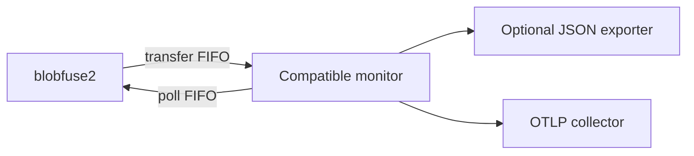

# BlobFuse Health Exporter: High-Level Design

Status: Draft

## Design Documents

- [Source contract](source-contract.md)
- [Metrics contract](metrics.md)
- [Version 0 configuration](configuration.md)
- [ADR 0001: Adapter architecture](decisions/0001-adapter-architecture.md)
- [Post-v0 follow-up](future-work.md)

## Context

BlobFuse2 includes a companion process, `bfusemon`, that collects component,
process, and file-cache statistics. Today, `bfusemon` writes those observations
to rotating JSON files. It does not expose a standard telemetry protocol or a
metrics endpoint.

This project explores an independently deployable adapter that converts
BlobFuse health data into vendor-neutral telemetry without requiring changes to
an official BlobFuse installation.

## Goals

- Export useful BlobFuse health metrics through OTLP.
- Work with an unmodified, Microsoft-supported BlobFuse2 installation.
- Keep the collection and export path outside the BlobFuse I/O hot path.
- Preserve bounded CPU, memory, disk, and network overhead.
- Avoid exposing blob names, file paths, credentials, or other sensitive data.
- Detect compatibility breaks in BlobFuse's currently private monitor contract.
- Leave room for an upstream-native exporter if Microsoft accepts the design.

## Non-Goals

- Reimplement BlobFuse or its caching behavior.
- Provide filesystem traces or per-file telemetry in the first release.
- Modify mount configuration automatically.
- Guarantee compatibility with every historical BlobFuse version.
- Build a monitoring backend, time-series database, or dashboard service.

## Proposed Evolution

### Phase 1: JSON Adapter

Read `bfusemon` rotating JSON reports and translate supported observations into
OTLP metrics.

This phase is a transport and metric-model prototype, not full observability
parity with other object-storage filesystems. It validates user demand with no
BlobFuse changes and identifies producer-side telemetry that must be proposed
upstream. The adapter must tolerate incomplete active JSON arrays, file
rotation, restarts, duplicate observations, and truncated files.

### Phase 2: Compatible Monitor Process

Optionally replace `bfusemon` with a compatible companion binary that implements
the existing command-line and FIFO behavior while exporting observations
directly to OTLP.

This removes rotating-file parsing but depends on an undocumented and
unversioned BlobFuse protocol. Compatibility tests are therefore required.

### Phase 3: Upstream Exporter Contract

Propose a versioned observation model and pluggable exporter contract for
`bfusemon`. JSON remains the default exporter and OTLP becomes an optional
exporter. Backend-specific routing remains the responsibility of an
OpenTelemetry Collector.

## Logical Components

1. **Input watcher** detects report creation, append, rotation, and restart.
2. **Incremental decoder** recovers complete observations from active reports.
3. **Normalizer** maps version-specific BlobFuse fields into an internal model.
4. **Metric translator** converts supported aggregate values into stable
  counters and gauges.
5. **In-memory source state** tracks identity, generation offsets, per-series
  baselines, resets, and deduplication.
6. **OTLP exporter** periodically exports cumulative state with one bounded
  request in flight.
7. **Self-observability** reports adapter health, source discontinuities,
  identity failures, parse errors, and export failures.

## Initial Metric Principles

- Prefer aggregate counters and gauges over per-file events.
- Use monotonic counters for transferred bytes and operation totals.
- Represent process memory and cache usage in bytes, not formatted strings.
- Treat process and mount restarts as counter resets.
- Keep labels bounded and documented.
- Never use file paths, blob names, container names, or arbitrary error text as
  metric labels.
- Mark metrics derived from unstable source fields as experimental.

The proposed names, types, units, attributes, and source conversions are defined
in the [metrics contract](metrics.md).

## Compatibility Strategy

- Record the BlobFuse and `bfusemon` versions with every source session.
- Maintain fixture reports for each supported version.
- Test active-file append, rotation, abrupt termination, and process restart.
- Fail visibly on an unknown schema while preserving unaffected metrics.
- Publish a support matrix rather than assuming compatibility.

## Security and Privacy

- Send version 0 OTLP only to a loopback endpoint.
- Support TLS and authentication through the OpenTelemetry Collector.
- Do not log telemetry payloads by default.
- Redact paths and other source identifiers before export.
- Run without Azure Storage credentials; the adapter only consumes local health
  data.
- Require an empty, dedicated health-report directory for each mount and run
  the adapter under the same effective UID as `bfusemon`.
- Open reports relative to a validated directory descriptor with no-follow
  semantics and verify owner, mode, type, device, and inode after opening.
- Launch BlobFuse with `umask 077` so the upstream `0755` creation mode does not
  leave group or other access.

## Deployment Model

Version 0 targets a systemd companion process on a Linux host. The executable
does not depend on systemd, but AKS packaging, PID-namespace integration, and
Blob CSI report-volume discovery are post-v0 deployment work.

Prometheus deployments consume the cumulative OTLP metrics through an enabled
Prometheus OTLP receiver or an OpenTelemetry Collector exposing a Prometheus
endpoint. Version 0 does not provide a direct scrape endpoint.

## Version 0 Scope Decisions

- Support BlobFuse2 `2.5.6` / `bfusemon` `1.0.0-preview.1` fixtures first.
- Consume active JSON incrementally through the source state machine.
- Export cumulative metrics with OTLP/HTTP Protobuf to a loopback endpoint.
- Identify one live source through boot ID, PID, and procfs start ticks.
- Use best-effort delivery with no historical replay or lossy adapter queue.
- Apply the defaults, deadlines, and resource budgets in the
  [version 0 configuration](configuration.md).

## First Milestone

Produce a read-only proof of concept that:

1. consumes recorded `bfusemon` JSON fixtures,
2. handles incomplete reports and append/rotation during initialization,
3. emits a small, documented OTLP metric set,
4. rejects stale process history and unsafe report paths,
5. includes compatibility, precision, privacy, and lifecycle tests,
6. runs against an OpenTelemetry Collector and Prometheus locally, and
7. meets the configured timing and resource budgets.

## Post-v0 Scope

Accepted follow-up directions are tracked in
[Post-v0 Follow-Up](future-work.md). They cover a declarative metric registry,
typed procfs metrics, direct secure OTLP configuration, and permanent exporter
failure classification. They are intentionally not v0 acceptance criteria.