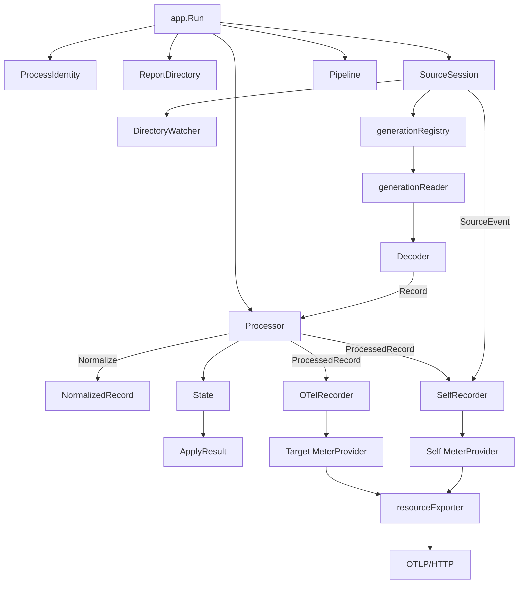

# Implementation Status

Last updated: 2026-08-22

The version 0 implementation and its validation workflows are tracked on
`main`; this document records the currently verified behavior and environments.

## Completed Slices

- Incremental JSON array framing with explicit record commit boundaries.
- Strict source normalization with fixed metric-series enums and privacy tests.
- Linux boot ID, PID start-tick, process-creation-time, and instance-ID handling.
- Descriptor-relative, no-follow report directory and file opening.
- Exact-PID directory rescanning and device/inode generation deduplication.
- Oldest-to-newest generation ordering.
- Per-generation incremental reading with partial-tail retention and truncation detection.
- Descriptor registry that survives report rename and pathname removal.
- Payload-blind inotify rescan triggers.
- Bounded baseline initialization and atomic live-cutover watermarks.
- Live append and rotation reconciliation with periodic identity checks.
- Bounded source draining and unclean-generation reporting.
- Per-series metric baselines, deltas, resets, and session gauge lifetime.
- Fixed metric names, units, instrument kinds, and bounded attributes.
- Cumulative OpenTelemetry recording with observable gauge removal.
- Privacy-bounded BlobFuse resources and OTLP/HTTP Protobuf export.
- Explicit exporter endpoint, timeout, retry, compression, header, proxy, and
  temporality configuration that overrides OpenTelemetry environment values.
- Version 0 configuration validation and command-line parsing.
- Linux application lifecycle orchestration and executable entry point.
- Sanitized BlobFuse 2.5.6 framing fixtures for empty, partial, trailing-comma,
  cleanly closed, and escaped sensitive-path records.
- Source microbenchmarks for one-MiB decoding, normalization, and partial-tail
  continuation.
- External OpenTelemetry Collector and native Prometheus OTLP smoke fixtures.
- Credential-free Azurite real-mount coverage through BlobFuse, `bfusemon`,
  strict report validation, exporter translation, and Prometheus OTLP ingestion.
- BlobFuse's upstream quick stress workload in pull-request gating, with
  post-baseline lower bounds for create-directory, delete-file, and
  delete-directory counters.
- Daily and manually dispatched repeated quick-stress coverage with sanitized
  Prometheus and detailed OTLP evidence. The summary distinguishes planned
  workload volume from best-effort observed counter lower bounds.
- Adapter self-metrics under a separate resource, exported through one periodic
  trigger and a serialized target/self transport.
- BlobFuse 2.5.6 compatibility-matrix coverage for shutdown artifacts and
  races, exact 10 MiB ten-file rollover, stale same-PID retained reports,
  omitted fields, never-observed metrics, oversized records, and supported
  virtual-memory suffixes.
- Repository-owned LF normalization through `.gitattributes` and
  `.editorconfig`, producing consistent Windows and WSL Git status.
- GitHub Actions validation for module tidiness, formatting, shell and workflow
  linting, vet, unit and race tests, Linux builds, checksum-pinned Collector and
  Prometheus smoke tests, and isolated resource-budget runs.

## Implementation Model

The implementation is divided into four layers with explicit ownership and
callback boundaries.

| Layer | Key entities | Responsibility |
| --- | --- | --- |
| Application | `config.Config`, `app.Run`, `app.Result` | Validate configuration, compose the runtime, and coordinate ordered shutdown |
| Source | `ProcessIdentity`, `ReportDirectory`, `DirectoryWatcher`, `generationRegistry`, `generationReader`, `Decoder`, `GenerationWatermark`, `SourceSession`, `SourceEvent` | Securely discover, frame, order, and commit rotating report generations |
| Metrics | `NormalizedRecord`, `Series`, `State`, `ApplyResult`, `ProcessedRecord`, `Processor`, `OTelRecorder`, `SelfRecorder` | Convert untrusted JSON into privacy-bounded metric state and adapter health signals |
| Telemetry | `Pipeline`, target and self `MeterProvider` instances, `resourceExporter`, OTLP exporter | Collect two resource scopes and export them serially through one transport |

### Entity Relationships



### Runtime Interaction

1. `app.Run` captures `ProcessIdentity` and securely opens `ReportDirectory`.
2. `SourceSession` registers `DirectoryWatcher` before scanning and retains each
  device/inode generation in `generationRegistry`.
3. Each `generationReader` feeds appended bytes to its `Decoder`; complete
  records are committed only after their handler succeeds.
4. Initialization sends records to `Processor` in baseline mode. `State`
  establishes independent counter baselines and current gauges without
  exporting historical increments.
5. A stable rescan publishes immutable `GenerationWatermark` values as the
  baseline-to-live cutover.
6. `Pipeline` is created only after cutover and attaches `OTelRecorder` and
  `SelfRecorder` observers to `Processor`.
7. Live reconciliation rescans authoritatively, drains retained descriptors
  oldest-first, and emits bounded rotation or discontinuity `SourceEvent`
  values.
8. `Processor` normalizes each record, applies it to `State`, updates processing
  statistics, and emits a privacy-safe `ProcessedRecord`.
9. `OTelRecorder` records BlobFuse metric changes while `SelfRecorder` records
  adapter outcomes, resets, rotations, discontinuities, and export errors.
10. The periodic target reader triggers `resourceExporter`, which exports the
   BlobFuse resource and then manually collects and exports the adapter resource
   with at most one HTTP request in flight.
11. When the captured process identity ends, `SourceSession` performs a bounded
   final drain; `app.Run` removes gauges, flushes telemetry, and closes all
   retained descriptors.

The central ownership rule is that source processing controls watermark
advancement, metric state controls translation, and telemetry observes both
without controlling either. Export failure therefore cannot roll back source
state or cause an accepted record to be replayed.

## Current Validation

The following checks pass in WSL Ubuntu with Go 1.25.7:

```text
go test -count=1 ./...
go test -shuffle=on -count=10 ./...
CGO_ENABLED=1 go test -race -count=1 ./...
go vet ./...
go mod tidy
go mod verify
gofmt -l main.go main_test.go internal/*/*.go
go build .
otelcol validate --config=file:test/integration/otelcol.yaml
promtool check config test/integration/prometheus-otlp.yaml
bash test/integration/collector-smoke.sh
bash test/integration/prometheus-smoke.sh
E2E_STRESS_MODE=quick BLOBFUSE2_REPO=/path/to/azure-storage-fuse \
  bash test/integration/azurite-mount-e2e.sh
E2E_STRESS_MODE=quick E2E_STRESS_ITERATIONS=50 \
  BLOBFUSE2_REPO=/path/to/azure-storage-fuse \
  bash test/integration/azurite-mount-e2e.sh
go run github.com/rhysd/actionlint/cmd/actionlint@v1.7.7 .github/workflows/*.yml
```

Focused tests cover source framing and lifecycle, numeric precision, privacy,
metric translation, cumulative temporality, provider epoch timestamps, exact
OTLP resources and attributes, environment isolation, CLI validation, and
bounded external-cancellation shutdown. Loopback HTTP integration tests inspect
both request behavior and decoded OTLP Protobuf payloads.

The initial WSL benchmark sample on an Intel Xeon Platinum 8370C reported:

```text
BenchmarkDecoderOneMiBActiveReport    59.47 MB/s    12,379,336 B/op
BenchmarkNormalizeAggregateRecord    144 us/op         55,328 B/op
BenchmarkDecoderPartialTailAppend      21 us/op          4,632 B/op
```

These are development baselines, not yet the five-minute acceptance-budget
measurements required by the configuration contract.

The external smoke tests use checksum-verified, user-local Linux amd64 binaries:
OpenTelemetry Collector `0.159.0` and Prometheus/promtool `3.14.0`. The Collector
test verifies the detailed cumulative OTLP payload. The Prometheus test verifies
native OTLP ingestion without a delta-to-cumulative processor; its translated
read-counter series reaches the expected cumulative value of 37. Both tests
exercise baseline-to-live cutover, source-process termination, approved resource
attributes, separate adapter self-metrics, and rejection of injected sensitive
markers.

Five-minute resource-budget acceptance passed on Ubuntu 26.04 LTS under WSL2,
Linux `6.18.33.2-microsoft-standard-WSL2`, an Intel Xeon Platinum 8370C with 32
logical CPUs, Go 1.25.7, and GCC 15.2.0. These budget runs used sanitized
fixtures from BlobFuse2 `2.5.6` and `bfusemon` `1.0.0-preview.1`, not a live
mount:

```text
Idle, 300 samples, 30s export, 5s rescan:
  median CPU       0.00% of one core
  average CPU      0.27% of one core
  peak RSS        17,874,944 bytes

Load, 300 samples, 1 MiB/s fixture, rotation every 10 records:
  records written 296
  median CPU       6.00% of one core
  average CPU      5.89% of one core
  p95 CPU          8.99% of one core
  peak RSS        89,522,176 bytes
```

The load acceptance enforces average CPU because the contract specifies median
only for idle CPU. Short aggressive calibration runs correctly failed the
contract thresholds, proving the harness does not report unconditional success.

The real-mount E2E passed separately on the same WSL host using BlobFuse commit
`fb058fda6460443bbe64d19e9e836f2913d282bb`, BlobFuse2 `2.5.6`, `bfusemon`
`1.0.0-preview.1`, Microsoft Go `1.26.4`, and Azurite `3.29.0`. It verified a
strict-mode report source, a live `CreateDir` counter increment, process virtual
memory, bounded resource labels, path privacy, unmount, and exporter shutdown.

The `CI` workflow runs deterministic validation, both external smoke tests, and
the credential-free Azurite real-mount job for pull requests and pushes to
`main`. The real-mount job publishes its Prometheus metric table to the workflow
summary and retains sanitized detailed Collector OTLP output for 14 days. The
real-mount job uses BlobFuse's upstream quick stress workload. The `Daily
Blobfuse stress` workflow runs 50 isolated quick-mode iterations daily and on
manual dispatch, outside the pull-request critical path. The `Performance
budgets` workflow runs the five-minute idle and load scenarios weekly and on
manual dispatch.

## Known Limits

- The JSON source has no generation sequence number. The adapter exposes the
  bounded `generation_missing` self-metric reason but cannot emit it merely
  because a pathname is absent; doing so would invent a discontinuity. Proven
  truncation, oversize, stale-generation, and unclean-close events are emitted.
- Docker and Podman remain unavailable in WSL, but they are no longer blockers:
  the external smoke tests run directly against checksum-verified user-local
  Collector and Prometheus binaries.
- Versioned source captures currently target BlobFuse 2.5.6 in this Ubuntu WSL
  environment. Parser tests cover all documented `top` memory suffixes, but
  portability is not claimed for additional distributions or BlobFuse versions
  until sanitized reports from those environments are added.
- The real-mount E2E uses Azurite and does not establish compatibility with the
  Azure Storage service.

## Next Slice

Optionally expand compatibility evidence with sanitized captures from additional
Linux distributions and BlobFuse versions before claiming support for them.