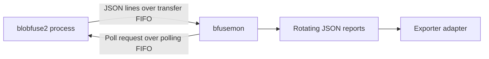

# BlobFuse Health Report Source Contract

Status: Draft, reverse-engineered

## Purpose

This document defines the input that the first exporter prototype is expected to
consume. It describes observed implementation behavior, not a compatibility
promise made by the BlobFuse project.

The reference source inspected on 2026-08-20 and exercised through a live
Azurite-backed mount on 2026-08-21 reports:

- BlobFuse2 version `2.5.6`
- `bfusemon` version `1.0.0-preview.1`
- Azure Storage Fuse commit `fb058fda6460443bbe64d19e9e836f2913d282bb`

Compatibility with any release must be demonstrated by fixtures and tests. A
matching filename is not sufficient evidence of a compatible schema.

## Process Topology

One `bfusemon` process is associated with one BlobFuse mount process. BlobFuse
starts `bfusemon` with its process ID and health-monitor configuration.



The phase-one adapter consumes report files only. The two FIFOs are outside its
contract.

## Report Discovery

`bfusemon` writes reports under `health_monitor.output-path`. If the setting is
empty, it uses its current working directory.

For a monitored BlobFuse PID `1234`, filenames are:

```text
monitor_1234.json       current report
monitor_1234_1.json     previous report
...
monitor_1234_9.json     oldest retained report
```

Each report is limited to approximately 10 MiB. Ten files are retained. During
rotation, `_9` is deleted, `_8` through `_1` are shifted up one index, the
current file becomes `_1`, and a new current file is created.

The adapter must select a PID explicitly. It must not merge every
`monitor_*.json` file in a shared directory into one source session.

### Live Source Identity

Version 0 consumes one live BlobFuse process from one dedicated report
directory. The directory must be created empty for that mount before
`bfusemon` starts and must not be reused across mount lifetimes. This is a
correctness requirement as well as a privacy requirement: `bfusemon` rotates
pre-existing files with the same PID into the retained set, while report
records contain no process-creation identity.

Before opening reports, the adapter must read the BlobFuse process start ticks
from `/proc/<pid>/stat` and the host boot ID. The live source-session identity
is the tuple of boot ID, PID, and process start ticks. Failure to obtain a
stable identity is fatal in version 0. Reading procfs for identity does not
enable the deferred procfs process metrics.

At startup and every rescan, the adapter must reject any matching report
generation whose descriptor modification time is earlier than the verified
process creation time. If process creation time or file timestamp precision is
insufficient to make that comparison, startup fails closed and the operator
must provide a freshly created directory. This runtime check enforces the
empty-directory deployment invariant under the trusted-UID threat model.

The adapter rechecks process start ticks during periodic rescans. A missing
process or changed start time ends the source session; version 0 does not attach
automatically to a new process that reuses the PID.

### Source Permissions

Reports contain file and blob paths. The inspected `bfusemon` implementation
passes mode `0755` when it creates a report file; the effective mode is reduced
only by the process umask. A typical permissive umask can therefore leave the
report readable by other local users.

Version 0 assumes the kernel, root, and processes running under the report
owner's UID are trusted. It defends against access by other local users and
against accidental path substitution. The adapter and `bfusemon` must run with
the same effective UID.

Production deployments must use an absolute, dedicated report directory with
mode `0700` and launch BlobFuse/`bfusemon` with `umask 077`. The adapter must:

1. open the directory once with directory and no-follow semantics;
2. verify through the opened descriptor that it is a directory owned by the
  adapter UID with no group or other permission bits;
3. open reports relative to that directory descriptor with no-follow
  semantics;
4. verify each opened report is a regular file with the expected owner and no
  group or other permission bits; and
5. use the opened descriptor's device and inode as the generation identity.

Checks must apply at startup and after rotation. A development-only insecure
source override may relax owner and mode checks, but it must not allow symlinks,
non-regular files, or pathname-only validation. The adapter must not silently
change ownership or permissions on files produced by another process.

## File Framing

The exporter writes one JSON array per report file, but the current file is not
valid JSON while it is active.

The file starts with:

```text
[
```

Each flushed object below the rotation threshold is followed by a comma and a
newline:

```text
[{"Timestamp":"2026-08-20T12:00:00Z",...},
```

Rotation writes the final `]` after the object that crosses the size threshold.
The inspected graceful-shutdown path attempts to write buffered objects and a
closing bracket, but it does so before stopping and joining the exporter worker.
It also writes no bracket when the in-memory output list is empty. Graceful
shutdown therefore does not guarantee either a complete flush or a closed
array.

Therefore:

- the active file normally ends with `,\n` and no closing bracket;
- graceful or abrupt process exit can leave `[` alone, a trailing comma, or a
  partial object;
- the explicit BlobFuse health-monitor stop command uses `kill -9`, so it
  bypasses JSON finalization;
- a newly created report with no flushed observations can contain only `[`.

A standard whole-file `json.Unmarshal` is not a valid live-consumption
strategy.

## Flush Delay

The in-process `StatsExporter` groups observations by their exact timestamp. It
keeps up to three distinct timestamp buckets in memory. When a fourth timestamp
arrives, the oldest bucket is flushed to disk.

Consequences:

- the newest three timestamp buckets are absent from the active file;
- report visibility can lag collection by multiple polling intervals;
- graceful shutdown attempts to flush remaining buckets but can race the
  exporter worker and lose them;
- an abrupt shutdown can lose all buckets still held in memory.

Both the monitor input channel and BlobFuse component channels have capacity
10,000. When full, the oldest queued item is removed. The report format does not
contain a dropped-record count.

## Top-Level Observation Schema

Each complete array element has this logical shape:

```json
{
  "Timestamp": "2026-08-20T12:00:00Z",
  "BlobfuseStats": [],
  "FileCache": [],
  "CPUUsage": "12.5%",
  "MemoryUsage": "1234m",
  "NetworkUsage": ""
}
```

All fields except `Timestamp` are optional because the Go structure uses
`omitempty`. In practice, a record commonly contains only one source type.

| Field | JSON type | Observed meaning |
| --- | --- | --- |
| `Timestamp` | string | RFC 3339 timestamp used as an aggregation key |
| `BlobfuseStats` | array | Component snapshots and path-bearing events |
| `FileCache` | array | File-cache directory watcher events |
| `CPUUsage` | string | Linux `top` `%CPU` value with `%` appended |
| `MemoryUsage` | string | Linux `top` `VIRT` value, including a size suffix |
| `NetworkUsage` | string | Reserved field; the network monitor is not registered |

Timestamps are formatted with `time.RFC3339`, which has one-second resolution.
Observations from independent monitors that happen within the same second can
be grouped into the same top-level object.

## BlobFuse Component Message Schema

Each `BlobfuseStats` element is a `PipeMsg`:

```json
{
  "timestamp": "2026-08-20T12:00:00Z",
  "componentName": "azstorage",
  "operation": "CreateFile",
  "path": "directory/file",
  "value": {
    "Mode": "-rwxrwxrwx"
  }
}
```

The optional fields distinguish two message classes.

### Aggregate Snapshot

An aggregate snapshot normally has `componentName` and `value`, while
`operation` and `path` are absent. Its values are accumulated inside the
BlobFuse process.

```json
{
  "timestamp": "2026-08-20T12:00:00Z",
  "componentName": "azstorage",
  "value": {
    "Bytes Downloaded": 1048576,
    "Bytes Uploaded": 524288,
    "OpenFileHandles": 2,
    "CreateFile": 8
  }
}
```

Important semantics:

- counters and current-value gauges share the same untyped `value` map;
- a static field mapping is required to distinguish them;
- snapshots are emitted only when a component value changed;
- absence in a later report means unchanged, not zero;
- there is no complete cross-component snapshot;
- a key might not exist until its operation first occurs, so an unobserved key
  is unknown rather than zero;
- `timestamp` is the time of the last component update, not the poll time;
- cumulative values reset when the BlobFuse process restarts.

Startup reconstruction must therefore happen independently per supported
metric series. Scanning retained reports can recover each series' latest known
value, but it cannot prove that an unobserved series has a zero value.

### Numeric Precision

BlobFuse creates aggregate counters as `int64`, but `bfusemon` unmarshals the
FIFO payload into `map[string]any` before writing reports. JSON numbers
therefore pass through binary64 and are not guaranteed exact above `2^53`.

The adapter must use `json.Decoder.UseNumber` or an equivalent exact lexical
decoder. Supported counter and integer-gauge values must be integral,
non-negative, and no greater than `2^53`. Fractional, overflowing, negative, or
larger values are omitted and counted as invalid. This prevents additional
adapter-side rounding but cannot recover precision already lost in `bfusemon`.

Only these components currently construct stats collectors:

- `libfuse`
- `file_cache`
- `azstorage`

Known aggregate keys include:

| Component | Key | Source behavior |
| --- | --- | --- |
| `azstorage` | `Bytes Downloaded` | Cumulative byte counter |
| `azstorage` | `Bytes Uploaded` | Cumulative byte counter |
| `azstorage` | `OpenFileHandles` | Current open-handle value |
| `azstorage` | operation names | Cumulative component method-call counters; not Azure REST request counts |
| `libfuse` | `OpenFileHandles` | Current open-handle value |
| `libfuse` | operation names | Cumulative operation counters |
| `file_cache` | `Cache Usage` | Formatted size such as `12.500000 MB` |
| `file_cache` | `Usage Percent` | Formatted percentage |
| `file_cache` | `Files Downloaded` | Cumulative file counter |
| `file_cache` | `Files served from cache` | Cumulative cache-hit counter |

Known operation names include `CreateDir`, `DeleteDir`, `StreamDir`,
`RenameDir`, `CreateFile`, `DeleteFile`, `RenameFile`, `TruncateFile`,
`CreateLink`, `ReadLink`, `SyncFile`, `SyncDir`, and `Chmod`. Support must use an
explicit allowlist rather than accepting arbitrary map keys as metric
attributes.

In the live-tested BlobFuse2 `2.5.6` implementation, `CreateFile` is emitted as
an immediate path-bearing event but is not added to the `libfuse` aggregate
snapshot. `CreateDir` is aggregated and is therefore the real-mount E2E oracle.
The adapter retains `create_file` in its bounded allowlist for compatible source
versions and fixtures, but must not synthesize that counter when it is absent.

### Immediate Event

An immediate event normally contains `operation` and `path`. It is written to
the transfer FIFO as soon as the component processes it rather than waiting for
a poll.

Examples include file creation, deletion, rename, upload progress, and download
progress. Event values can include `Src`, `Dest`, `Target`, `Mode`, `Size`,
`Bytes Transferred`, and `Count`.

These records can expose user file and blob names. The metrics-only prototype
must parse them to advance its live read watermark, but must not export `path`
or event value fields.

## CPU and Memory Schema

The CPU/memory monitor executes:

```text
top -b -n 1 -d 0.2 -p <pid> | tail -2
```

It extracts `%CPU` and `VIRT` from the output header.

- `CPUUsage` is not normalized by the number of CPUs available to the process.
  It can exceed `100%` for a multithreaded process.
- `MemoryUsage` is virtual memory, not RSS or physical memory, despite the
  health-monitor README describing memory generically.
- `MemoryUsage` is a formatted string. If `top` returns a bare number,
  `bfusemon` appends `k`; otherwise the original suffix is retained.
- Output parsing depends on the target distribution's `top` format and locale.

The initial compatibility suite must include samples from every supported Linux
distribution before these strings are considered portable.

## File-Cache Event Schema

Each `FileCache` element has this shape:

```json
{
  "cacheEvent": "CREATE",
  "path": "/cache/directory/file",
  "isDir": false,
  "cacheSize": 1048576,
  "cacheConsumed": "1.00%",
  "cacheFilesCount": 1,
  "evictedFilesCount": 0,
  "value": {
    "FileSize": "1048576"
  }
}
```

The watcher handles create, remove, chmod, write, rename, and move events.
Write events update internal size state but are deliberately not exported.

These values are not authoritative filesystem statistics:

- tracking begins at zero when the monitor starts;
- existing cache contents are not used to initialize `cacheSize`;
- `cacheFilesCount` is the size of an internal created-path map;
- `evictedFilesCount` is the size of an internal removed-path map, not a
  monotonic eviction total;
- recreating a path removes it from the removed-path map;
- all paths are sensitive and must not become metric attributes.

The phase-one metric mapping uses the `file_cache` component snapshot for cache
usage and treats watcher events as unsupported input.

## Incremental Decoder Requirements

The adapter must process the active report as an append-only byte stream within
one file generation:

1. Validate and consume the opening `[`.
2. Decode only complete top-level JSON objects.
3. Use exact lexical number decoding rather than generic `float64` values.
4. Commit a byte offset only after an entire object and its following comma or
  closing bracket are consumed. Never derive a consumed offset from file size.
5. Treat a trailing comma followed by EOF as "wait for more data."
6. Treat EOF within an object as an incomplete record and retry after append.
7. Treat `]` as a cleanly closed generation.
8. Tolerate unknown object fields, but reject incompatible known-field types.
9. Enforce the configured maximum complete-object size before materializing a
  source DTO.

The decoder must use JSON tokenization. Brace counting alone is invalid because
braces and escaped quotes can appear inside strings.

## Initialization, Rotation, and Restart Requirements

The input watcher must combine filesystem notifications with periodic rescans.
Notifications alone are not reliable enough for startup races or dropped
events.

Initialization uses this ordered handoff:

1. Validate the live source identity and report-directory descriptor.
2. Register directory notifications before the first enumeration.
3. Enumerate matching reports, open them relative to the directory descriptor,
  and register each device/inode identity before reading it.
4. Process known generations oldest to newest in baseline mode. Complete
  objects update per-series state but emit no historical counter increments.
5. Drain queued notifications and rescan. Register unseen generations, retain
  open descriptors across renames, and repeat until every known descriptor is
  at its last complete-object boundary and one rescan finds no unseen
  generation.
6. Atomically mark the stored per-generation offsets as the live cutover.

The adapter must not seek any descriptor to its current file size during this
handoff. Bytes appended after a stored cutover offset are processed in live
mode, including bytes appended to a descriptor that has since been renamed.
Any partial-object decoder buffer at cutover remains attached to that open
descriptor and continues in live mode.
Activity consumed while initialization catches up is intentionally part of the
baseline; the live observation window begins at the cutover. Initialization
fails visibly if it cannot reach the cutover within the configured timeout.

For each source it must track:

- canonical report directory;
- BlobFuse PID;
- file generation identity, preferably device and inode on Linux;
- consumed byte offset;
- fingerprint of the last consumed object;
- whether a clean closing bracket was observed.

On current-file replacement, the adapter must finish reading the old open file
descriptor before switching to the new current file. This state is an in-memory
watermark for one adapter run. On restart, the adapter rescans retained reports
to establish the latest value of each supported series without exporting
historical counter increments.

The source provides no sequence number or event ID. Deduplication must therefore
be based on file generation plus consumed byte range during one adapter run,
with a content fingerprint used only as a consistency check.

When the source-session identity disappears or changes, the adapter enters a
bounded drain period. It continues processing complete objects from already
opened and newly discovered generations. At the drain deadline it consumes all
complete objects currently available, reports an unclean-close discontinuity
for an unclosed or partial tail, removes source gauges, performs a bounded OTLP
flush, and exits. Historical/offline processing must use a separately designed
persisted generation identity.

## Failure Policy

- Unknown top-level fields: ignore and count.
- Unknown component names or aggregate keys: ignore and count.
- Known field with incompatible type: omit that field and count a parse error.
- Partial final object: retain the last consumed offset and wait.
- Truncated or replaced file before the consumed offset: open a new source
  generation and report a discontinuity.
- Report exceeding the maximum complete-object size: reject the object and
  report a discontinuity without logging its contents.
- Unavailable or changed live process identity: enter bounded source draining;
  do not attach to the replacement PID automatically.
- Stale, wrong-owner, symlink, or non-regular report: fail closed unless only an
  owner or mode mismatch is explicitly allowed for development.
- Unreadable report: retry with bounded backoff and expose adapter health.
- No supported values in an otherwise valid object: advance the live read
  watermark without exporting a metric.

Raw records and paths must not be logged by default.

Known gauges retain their last value for the lifetime of the identified
BlobFuse source session. A missing key or quiet component is not evidence that
the gauge is stale. Gauge state is removed only when that source session
conclusively ends or is replaced by a new PID/process-creation identity.

## Required Fixture Matrix

No compatibility claim is valid until the repository contains fixtures for:

- empty active report containing only `[`;
- active report ending after a comma;
- active report ending inside an object;
- cleanly closed report produced by rotation or successful finalization;
- graceful shutdown leaving only `[` or a trailing comma;
- graceful shutdown racing queued observations;
- 10 MiB rotation and rename sequence;
- append during initialization immediately before and after live cutover;
- rotation during initialization with the old descriptor still open;
- a directory event dropped and recovered by rescan;
- abrupt `bfusemon` termination;
- same-PID files retained from an earlier process lifetime;
- report mtimes before, equal to, and after process creation time;
- process start time unavailable, disappearing, and changing;
- multiple source types sharing one timestamp;
- aggregate snapshot with unchanged fields omitted later;
- cumulative counter reset;
- unknown fields and incompatible known-field types;
- independently observed component and metric baselines;
- a metric key that never appears and must remain unknown;
- integer values at `2^53`, above `2^53`, fractional, negative, and overflowing;
- path strings containing quotes, braces, Unicode, and newlines;
- secure and insecure report permission modes, wrong ownership, symlinks, and
  pathname replacement after validation;
- a top-level object exceeding the configured size limit;
- supported `top` output variants and memory suffixes.

Real reports captured from a non-production test mount must be sanitized before
being committed.

## Upstream References

The behavior above is derived primarily from these BlobFuse source paths:

- `tools/health-monitor/main.go`
- `tools/health-monitor/internal/stats_export.go`
- `tools/health-monitor/monitor/blobfuse_stats/stats_reader.go`
- `tools/health-monitor/monitor/cpu_mem_profiler/cpu_mem_monitor.go`
- `tools/health-monitor/monitor/file_cache/cache_monitor.go`
- `internal/stats_manager/stats_manager.go`
- `cmd/health-monitor.go`
- `cmd/health-monitor_stop.go`

See the [metrics contract](metrics.md) for the subset translated into OTLP.